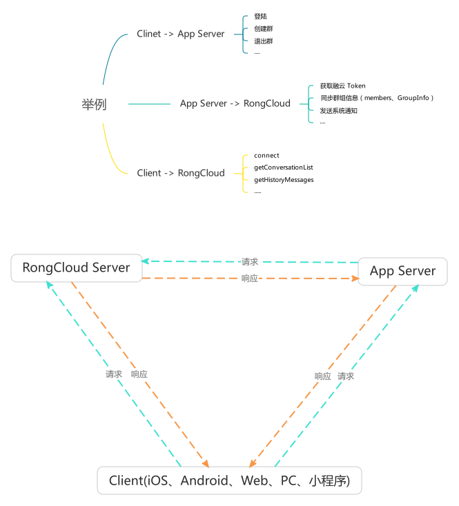

### 初出茅庐

> 直播时间计划 60 分钟

|    内容			 		 |	总时长（分钟)	|	部分时长（分钟）	|主播		  | 备注	| 
| :----------------------	 |:------------	|:------------------|:------------|:-----	|
| [结构介绍](./#structure) 	 |	10 			|	1 * 10			| 于洪达 	  |	共 1 部分，10 分钟结束	|
| [SDK介绍](./#sdk) 	 		 |	30 			|	5 * 6			| 张雷 + 于洪达 |	共 5 部分，每部分 6 分钟时间	|
| [在线互动](./#interactive) 	 |	10 			|	1 * 10			| 张雷 + 于洪达 |	共 1 部分，10 分钟结束	|
| 合计 	  	 		 		 |	50 			| 	50				||	暂留 10 分钟为缓冲时间，各部分可按实际情况上下浮动	|

#### 结构介绍{#structure}

按箭头指引介绍

> RongCloud Server 

RongCloud Server: 公有云、专有云、私有云、海外云

核心能力是传递消息，比如 A 给 B 发送消息，B 可以即时的收到

发送消息方式：

客户端 SDK + RongCloud Server 

Server SDK + RongCloud Server 

其他业务功能：

群组：创建、解散、同步群、群禁言（不维护群组关系）

聊天室：创建、销毁、聊天室封禁、全局禁言、内部禁言、消息分发、保活、消息白名单、用户白名单

敏感词：敏感词替换、屏蔽

历史消息下载、系统消息广播

> App Server 

用来管理业务数据，例如：群组信息、好友关系、用户信息

解释图例，getToken 的使用及获取流程

> Client(SDK)

各端 SDK 通过 `Token` 连接融云服务器，发送消息

历史消息获取

#### SDK 介绍{#sdk}

各端 SDK 均需要 Appkey、Secret ，请到 [开发者后台](https://developer.rongcloud.cn) 获取

>名词解释

日活、会话、历史消息、历史消息云存储、多设备消息同步

>Server SDK

基于 Server API 封装的 SDK，现有语言 Java、Node，App Server 调用，用来发送系统消息、群通知者其他业务

文档、API 示例均在 github

>Android SDK

+张雷 PDF 文件

>iOS SDK

+张雷 PDF 文件

>Web SDK

1、介绍 SDK 特性、引用方式、使用方法（需要 Appkey、Token）

2、准备简单 HTML 写一个示例

3、可支持收发消息

4、提供开源项目地址

#### 互动{#interactive}

1、在线提问，实时解答

2、想了解哪些，下次课程着重讲解

3、提供 demo 地址

4、留作业：开发者提供 github 地址或提交代码参与评选，可获得相应奖品(待议)
